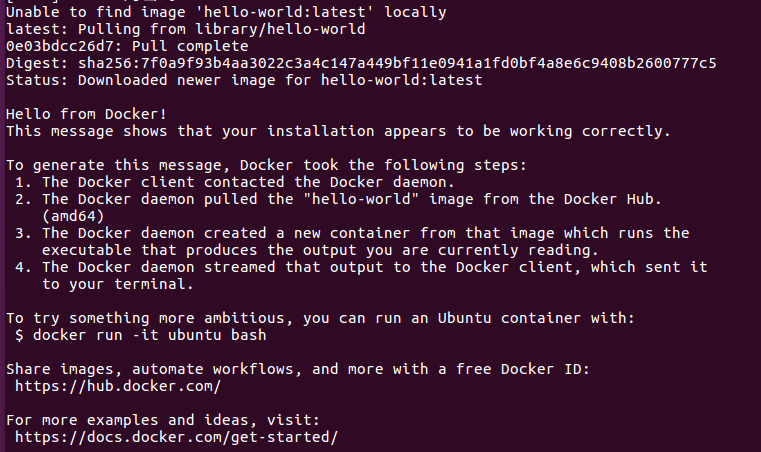

# Docker

> *Use docker to deploy your projects.*

#### what is docker?

___

#### The advantages of docker

___

#### Docker VS Virtual Machine

___

#### How to use Docker?

1. [Install Docker](techi)

   ```shell
   # 1.Uninstalled old version
   $ sudo apt-get remove docker docker-engine docker.io containerd runc
   
   # 2.Set up repository
   # update apt package index
   $ sudo apt-get update
   $ sudo apt-get install \
       apt-transport-https \
       ca-certificates \
       curl \
       gnupg-agent \
       software-properties-common
   # Add Docker’s official GPG key
   $ curl -fsSL https://download.docker.com/linux/ubuntu/gpg | sudo apt-key add -
   # set up docker repository
   # i don't recommend to use official repository
   $ sudo add-apt-repository\
      "deb [arch=amd64] https://download.docker.com/linux/ubuntu \
      $(lsb_release -cs) \
      stable"
   
   # 3.Install docker
   $ sudo apt-get update
   $ sudo apt-get install docker-ce docker-ce-cli containerd.io
   
   # 4.Verify that docker engine is installed correct
   $ sudo docker run hello-world
   ```

   

```py
1.pull from library/hello-world
2.the docker daemon pulled the "hello-world" img from the docker hub
3.the docker daemon created a new container from that image which runs the executable
4.the docker daemon streamed output to the docker client
```


2.[Docker Commands](techi)

```shell
# 1.pull image
docker pull container:tag

# 2.run image
docker run -p host_post:container_post image_id

# 3.mount file
docker run -v host_dir:container_dir image_id

# 4.start container
docker start container_id

# 5.restart container
docker restart container_id

# 6.stop container
docker stop container_id

# 7.kill container
docker kill container_id

# 8.check images
docker images

# 9.check containers
docker ps -a

# 10.docker network
docker network ls
ubuntu@VM-0-9-ubuntu:~$ sudo docker network ls
NETWORK ID          NAME                DRIVER              SCOPE
cd8e0ad56dcf        bridge              bridge              local
f9551c25f825        host                host                local
9677b5798b60        none                null                local

docker network create

# 11.save images
# you can make your own images and save it, then send it to your homie.
docker save -o output_path image_id

# 12.load images
# your homie receives images made by you and load it.
docker load -i file_path

# 13.commit your image
docker commit -a author_name -m some_messages container_id new_image:tag

# 14.push your image to docker hub
docker push image_id
```


